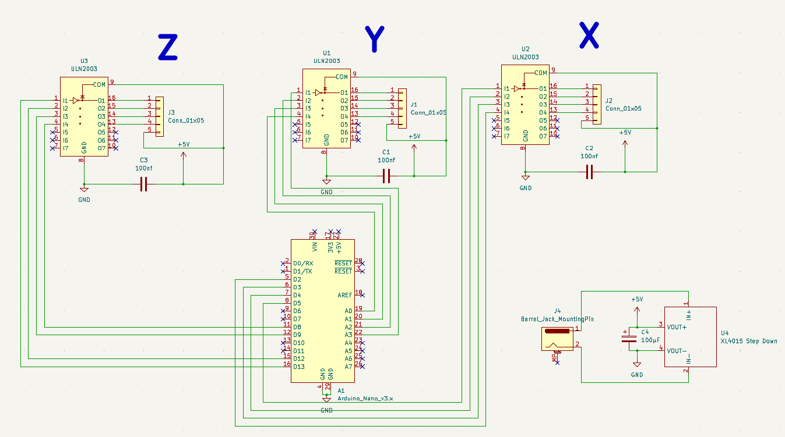

# 📠 Custom Mini CNC PCB Plotter (GRBL + Arduino Nano)

A fully custom-built Mini CNC Plotter designed as a **PCB Fabrication Tool**. This machine bridges the gap between digital design and physical manufacturing by plotting circuit tracks directly onto copper-clad boards for chemical etching.

## 🌟 Manufacturing Workflow (The Process)
The following technical workflow was successfully implemented and tested to manufacture PCBs:
1. **CAM Processing:** Utilized **FlatCAM** running on **Linux WSL** to process Gerber files and generate precise G-code for isolation plotting.
2. **G-Code Streaming:** Used **Universal Gcode Sender (UGS)** to stream the G-code to the Arduino Nano controller.
3. **Hardware Execution:** The machine uses a marker to draw the circuit layout on copper. This acts as an etch-resist layer.
4. **Chemical Etching:** The plotted board is then processed in a chemical acid bath to remove unwanted copper, leaving the final circuit tracks intact.

---

## 🛠️ Hardware Design & Architecture

Designed a dedicated custom control board around the **Arduino Nano** and **ULN2003** drivers for 3-axis control. Modified **GRBL** firmware to work with 5V unipolar stepper motors (28BYJ-48).

### 📐 Circuit Schematic
*(The image below loads directly from the Hardware/Schematics folder)*


### 📋 Bill of Materials (BOM)
| Component | Quantity | Description |
| :--- | :---: | :--- |
| **Arduino Nano (v3.x)** | 1 | Main Controller running modified GRBL |
| **ULN2003 IC** | 3 | Stepper Drivers for X, Y, and Z axes |
| **5V Stepper (28BYJ-48)** | 3 | Compact motors for precise movement |
| **XL4015 Module** | 1 | 5V Power Step-Down Regulator |
| **Capacitors** | 4 | 3x 100nF (Decoupling) & 1x 100uF (Smoothing) |
| **Custom PCB** | 1 | Main Control Board for wire management |

---

## 💻 Software & Calibration

This project uses a cross-platform toolchain combining Windows and Linux (WSL) to achieve professional PCB plotting results.

* **FlatCAM (Linux WSL):** Used for G-code generation from Gerber files. 
  * 📺 [Watch Tutorial Reference](https://www.youtube.com/watch?v=4Ct_jMvusXE)
* **UGS Calibration:** Used for precise mm adjustment. The `steps/mm` parameters (`$100`, `$101`, `$102`) were manually calibrated using a physical ruler to ensure exact dimensions.
  * 📺 [Watch Calibration Guide](https://www.youtube.com/watch?v=qJzQSFFPfGw)

*(To see software interface screenshots, check the Software folder below).*

---

## 📂 Repository Structure
Click on the links below to explore the project files:

* 📁 **[/Firmware](./Firmware)**: Modified GRBL source code configured for 5V steppers.
* 📁 **[/Hardware](./Hardware)**: 
  * 📄 `[/Schematics](./Hardware/Schematics)`: Contains the circuit diagrams.
  * 📄 `[/PCB-Design](./Hardware/PCB-Design)`: Custom PCB layout files.
* 📁 **[/Software](./Software)**: Documentation, FlatCAM (WSL) setup, and UI screenshots (`/screenshots`).
* 📁 **[/G-Code-Samples](./G-Code-Samples)**: Sample G-code files generated for PCB plotting.

---
### 👨‍💻 Developed by:
**Ahmed Fayez** *AI & Robotics Student* ```

---
