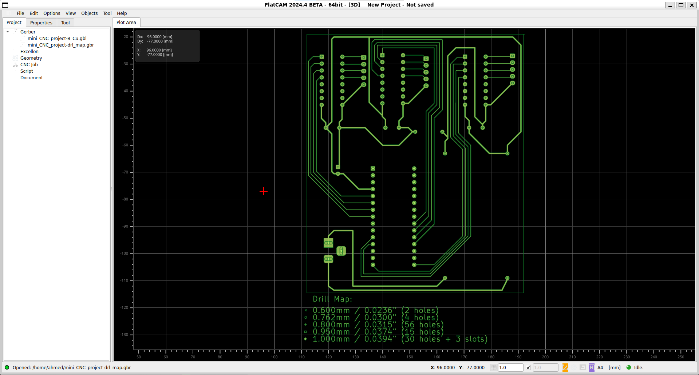

# 💻 Software Setup & PCB Workflow

This project uses a cross-platform toolchain combining Windows and Linux (WSL) to achieve professional PCB plotting results.

### 1. FlatCAM (on Linux WSL)
FlatCAM is used to convert PCB Gerber files into G-code isolation tracks.
* **Why WSL?** FlatCAM's isolation routing and geometry tools are highly stable in Linux environments.
* **Tutorial Reference:** [How to create PCB G-code in FlatCam](https://www.youtube.com/watch?v=4Ct_jMvusXE) - *This video explains the exact process of generating tracks from Gerber files.*

**[Screenshot Placeholder: FlatCAM Interface showing the plotted PCB tracks]**

---

### 2. Universal Gcode Sender (UGS)
Used to stream the G-code from the PC to the Arduino Nano controller.
* **Baud Rate:** 115200.
* **Step Calibration:** To ensure the drawing is accurate to the millimeter, the steps/mm must be calibrated.
* **Calibration Tutorial:** [UGS Stepper Motor Calibration Guide](https://www.youtube.com/watch?v=qJzQSFFPfGw) - *I followed this method using a physical ruler to tune `$100`, `$101`, and `$102` settings.*

**[Screenshot Placeholder: UGS Setup Wizard during calibration]**

---

### 3. Workflow Summary
1. **Design:** Create PCB in KiCad/EasyEDA -> Export Gerber.
2. **CAM:** Open Gerber in **FlatCAM** (Linux WSL) -> Generate Isolation G-code.
3. **Streaming:** Open G-code in **UGS** -> Connect to Arduino Nano.
4. **Execution:** Plotting with the Mini CNC -> Chemical Etching.
